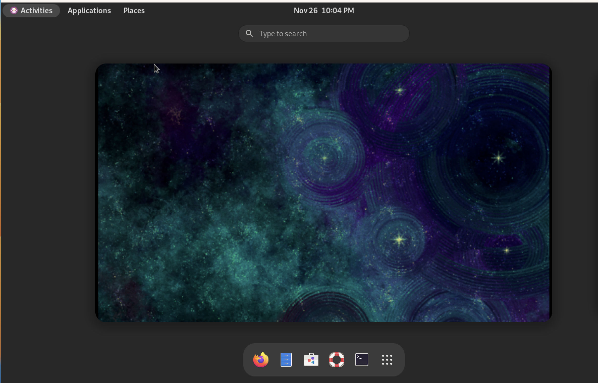

### Setup VMS (For MAC M1 users)

- Download CentOS Stream 9 iso from here:- https://www.centos.org/download/

- Go to UTM. Click + to create a new VM
- Click virtualize -> linux -> select boot iso
- Set drive size to 20 GB
- Right click on VM -> Edit -> Add a serial device
- Start VM
- Set root password
- Follow prompts for installtion
- Upon successful installation, remove the iso
- Boot the VM
- To create a second CentOS VM, simply clone the existing one by right clicking and select clone.
- Cloned VMS inherit similart properties to that of the parent and ends up with the same IP and user account.
- Right click on the cloned VM and click Edit. Go to network settings and click random to generate a new mac address
- Start the VM and check that it got a new IP address.
- Set hostnames on the 2 VM's

    - sudo hostnamectl set-hostname <centos-1|centos-2>
    - Refresh terminal for the changes to take into effect: exec bash

- Tweak gnome settings for user-friendly interface

- sudo dnf install gnome-tweaks
- gnome-extensions list
- gnome-extensions enable desktop-icons@gnome-shell-extensions.gcampax.github.com
- gnome-extensions enable apps-menu@gnome-shell-extensions.gcampax.github.com
- gnome-extensions enable places-menu@gnome-shell-extensions.gcampax.github.com
- gnome-extensions enable window-list@gnome-shell-extensions.gcampax.github.com

P.S: Some backstory on the VM creation process. I used mobile hotspot to download the 10G Centos Stream 9 iso as that was the faster way compared to the wifi speed at my place. The hotspot speed downgraded around halfway through at 4.5GB and then I was stuck at the slower speed. Regardless, it was worth it. I like the default cosmic background that centOS comes with.

This is how it looks!

